#### Step 1: Weighing of metal cylinder 

• Click on the metal cylinder to place it on the weighing balance. 
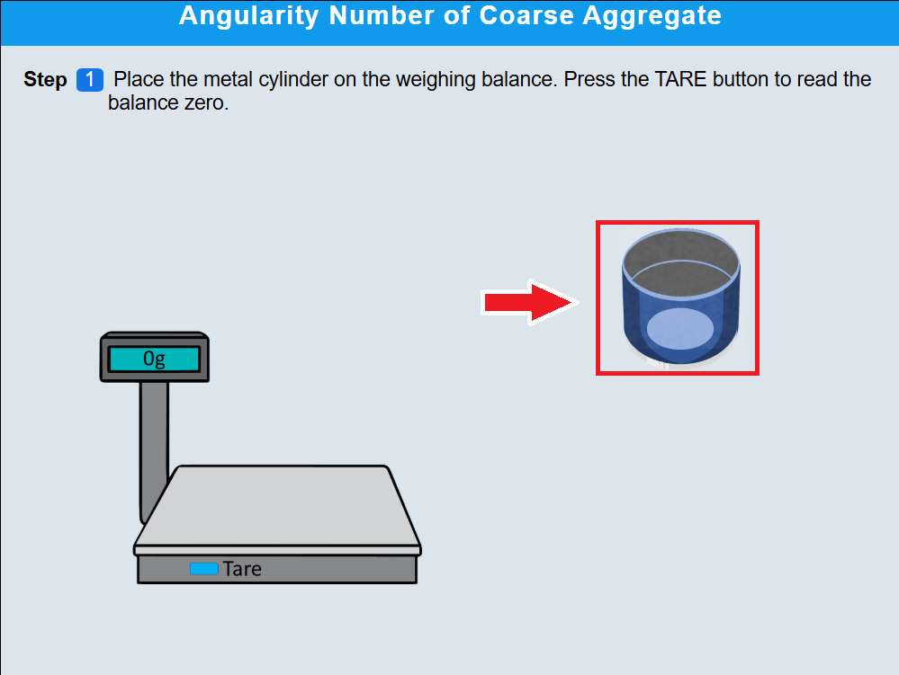 

•	Click TARE button to zero the reading 
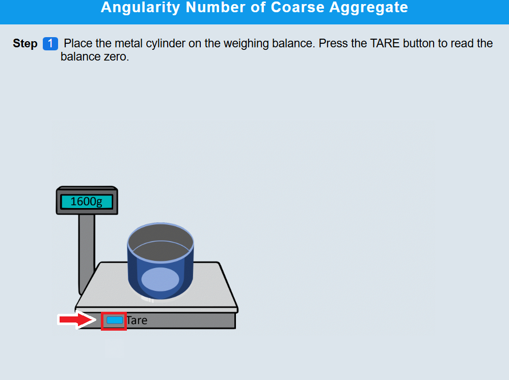 

•	Click on the metal cylinder to remove it from the weighing balance . 
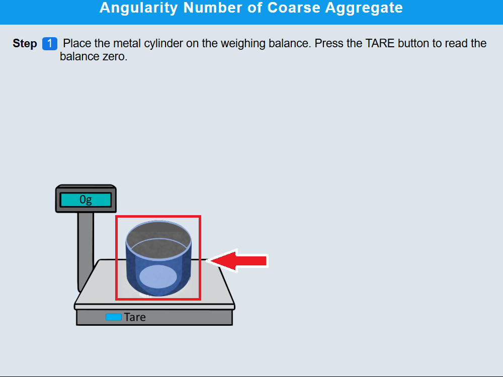 
 
• Click NEXT to proceed  

#### Step 2: Filling the cylinder with water
• Click on beaker to pour water into the metal cylinder carefully. 
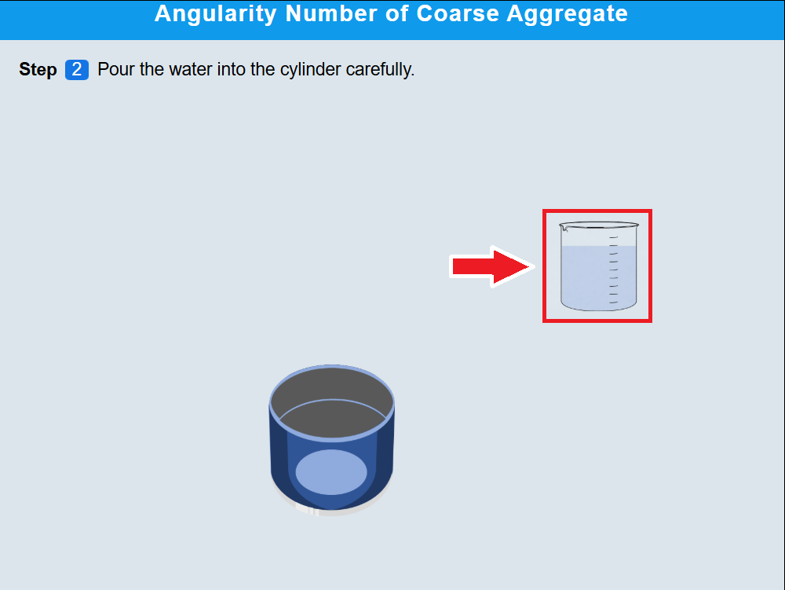 

• Click NEXT to proceed  

#### Step 3: Measuring the volume of water 
• Click on cylinder to note down the volume of water filled inside. 
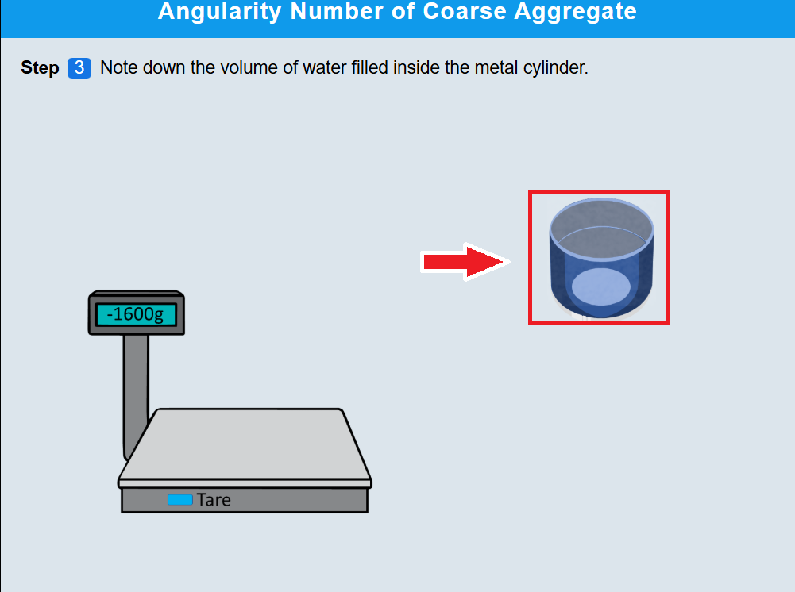 

• Click NEXT to proceed  

#### Step 4: Weighing of the tray 
•	Click on tray to place it on the balance. 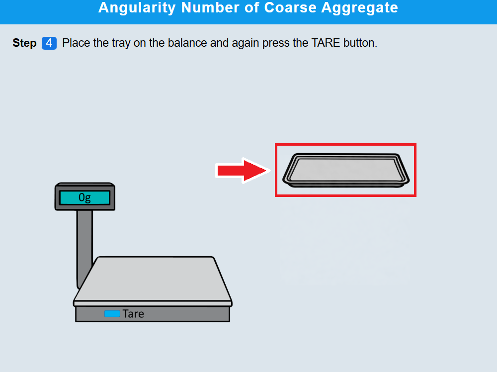 
 
• Click TARE button again to zero the balance. 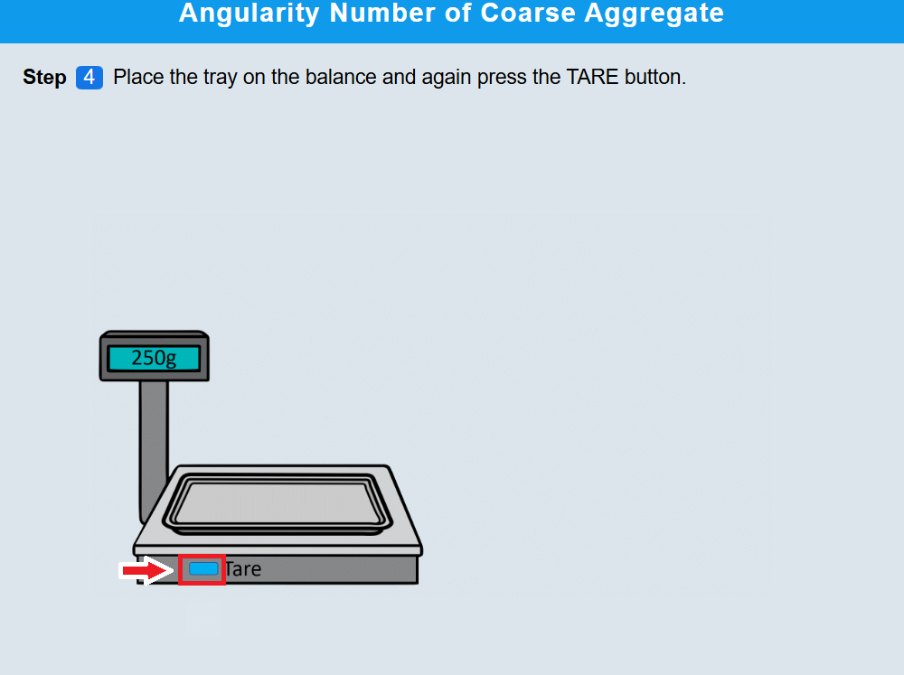 
 
• Click NEXT to proceed  

#### Step 5 : Take sufficient quantity of aggregates
• Click on tray to take sufficient quantity of aggregates and weigh them. 
 

• Click NEXT to proceed  

#### Step 6: Assemble the seives

• Click on "assemble" to arrange sieves in descending order with largest aperture at top and pan at bottom. 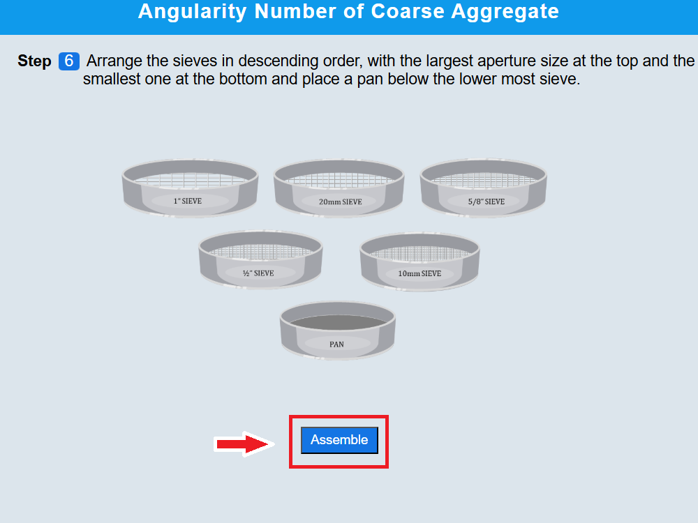 
 
• Click NEXT to proceed  

#### Step 7: Put the aggregates in the sieve stack

Click on tray to put the weighed aggregates on the sieve stack. 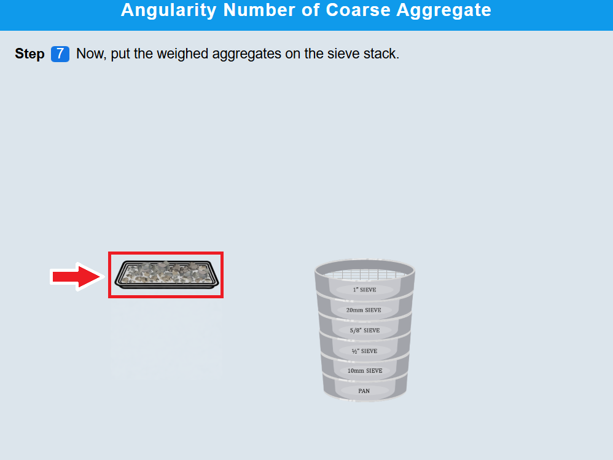 

• Click NEXT to proceed  

#### Step 8: Procedure for Conducting Sieve Analysis

• Click on lid to cover the sieve stack.  
 
• Click on the sieve stack to place it on shaker.  
 
• Click on the green button to start the machine.  
 
• Click on the lid to remove the sieve from the shaker. 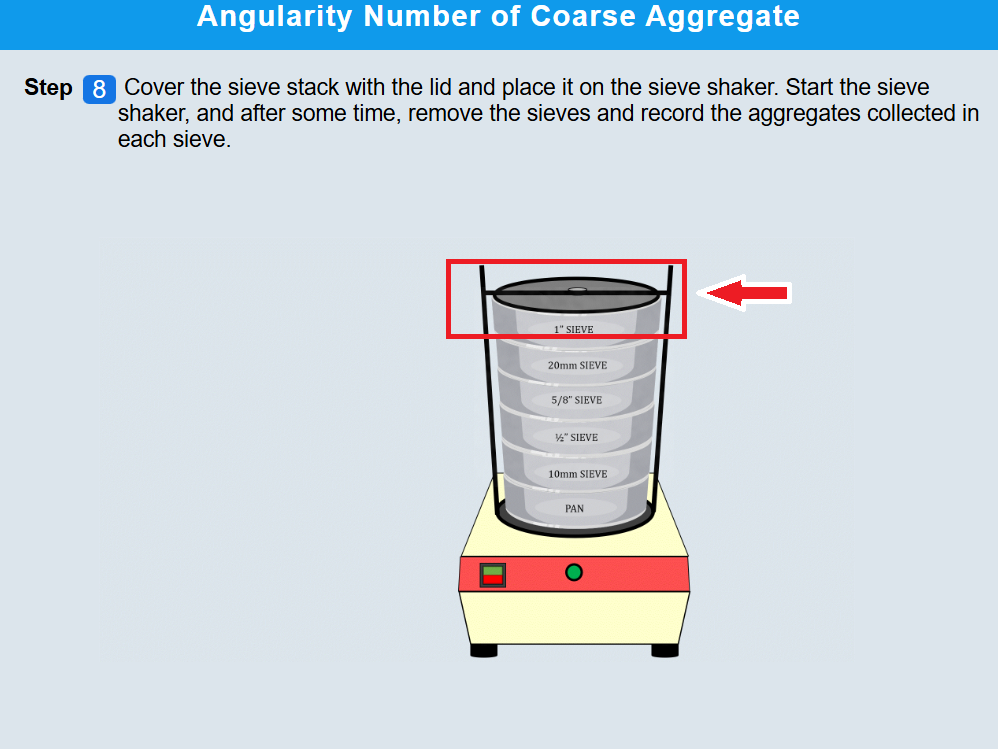 
 
• Click on the sieve to open it and record aggregates from each sieve.  
 
• Click NEXT to proceed   

#### Step 9: Aggregate Sample Preparation Procedure
•	Click on tray to fill aggregate in cylinder in three layers. 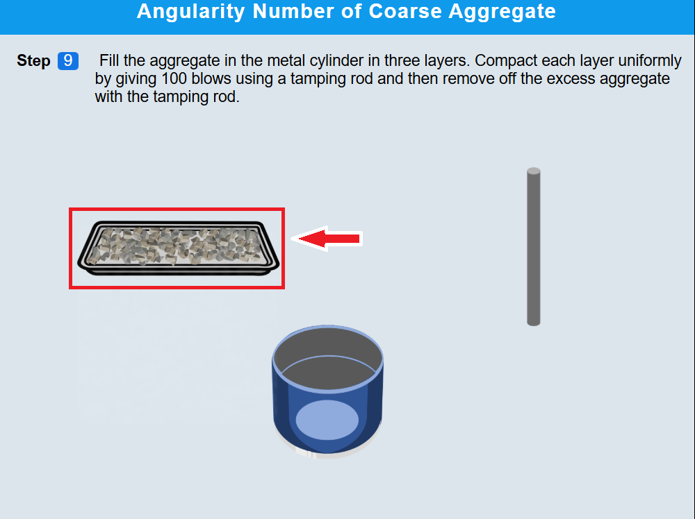 
 
•	compact each layer with 100 blows using tamping rod by clicking on it and remove excess of the material . 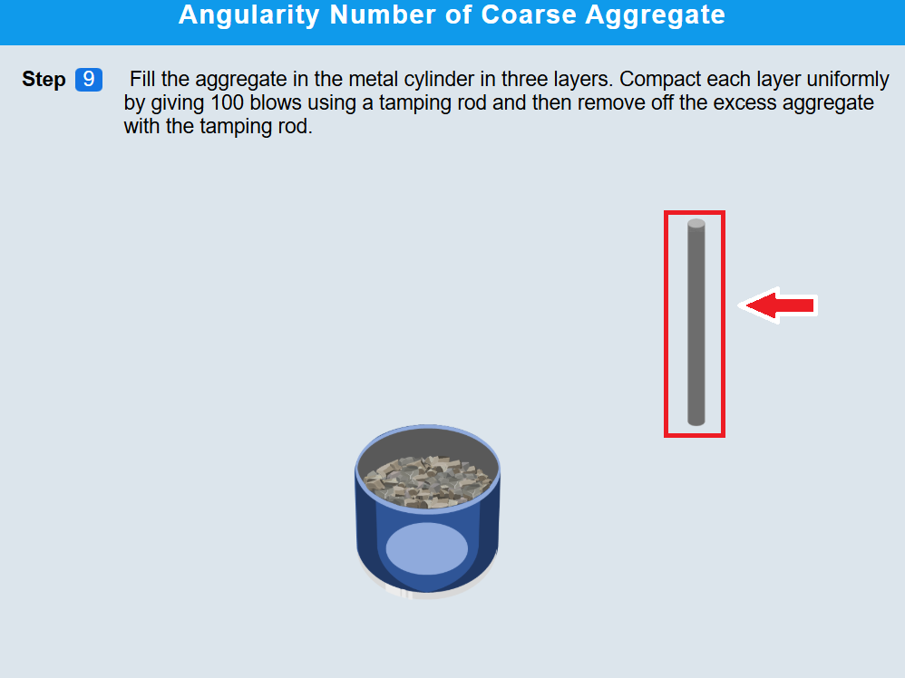 
  
•	Repeat this process three times by clicking on the aggregates tray and rod respectively . 

• Click NEXT to proceed  

#### Step 10: Weighing of aggregates

• Click on cylinder to weigh the aggregates along with the cylinder.  

• Click NEXT to proceed  

#### Step 11: Calculations
Calculate the average weight of aggregates.

